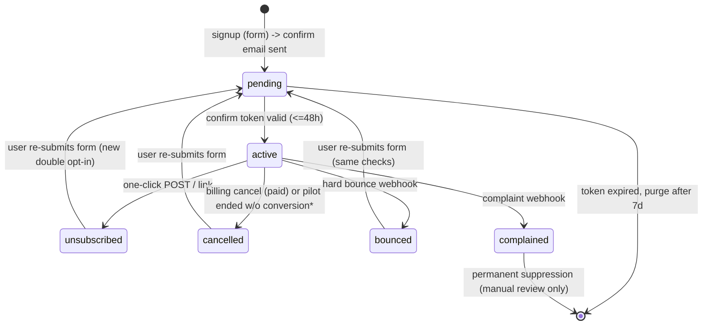

# מכרזון (Michrazon) — LLD (Low-Level Design)

**גרסה:** 0.1 (טיוטה לסקירה) · **תאריך:** 24.11.2026 · **כותב:** CTO, עבור בן בלום
**סטטוס:** DESIGN ONLY. קטעי SQL/קוד כאן הם מפרט, לא קוד שנכתב או הורץ.
**מסמך אב:** `HLD.md`. מקורות: `/workspace/state/income2/body.md`, `/workspace/state/income2/gate.md`. מה שאינו במקורות: **TBD/verify** (סעיף 18) או הנחה (סעיף 19).
קישורים לתנאים: הכול מתועד ב-HLD §6.

---

## 1. מודולים ורכיבים

מבנה מוצע (monorepo אחד, שמות הצעה בלבד; ה-repo לא נוצר):

```
michrazon/
  packages/core/        # types, config, source guard, hashing, tokens, clock (Asia/Jerusalem)
  packages/adapters/    # datagov-beersheva, mrgov-listing, (disabled stubs)
  packages/llm/         # provider interface + prompt + JSON schema validation
  packages/mail/        # templates (HTML RTL + text), Resend client, headers
  apps/worker/          # Railway: ingest, classify, digest, housekeeping entrypoints
  apps/web/             # Vercel: signup, confirm, prefs, unsubscribe, webhooks
  db/migrations/        # SQL (סעיף 3)
  tests/                # unit, contract, e2e (סעיף 15)
```

| מודול | אחריות | תלויות |
|---|---|---|
| `core/sourceGuard` | allowlist/denylist, בדיקת host, בדיקת content-type | config |
| `core/rateLimiter` | token bucket לכל host + תקרת בקשות לריצה | clock |
| `core/hash` | content hash ו-dedup key | — |
| `core/tokens` | טוקן HMAC חתום ל-confirm/unsubscribe/prefs | secret |
| `adapters/*` | fetch + parse + normalize | guard, limiter |
| `llm/*` | הפעלת מודל, ולידציה, post-check | provider |
| `mail/*` | רינדור, headers, שליחה | Resend |
| `worker/*` | סדר הריצות, אידמפוטנטיות, רישום ב-`pipeline_runs` | הכול |
| `web/*` | API routes (סעיף 14) | DB (service role ברמת שרת בלבד) |

## 2. מודל נתונים (סקירה)

ישויות: `sources` (קונפיג מקורות), `tenders` (עובדות מנורמלות), `tender_classifications` (פלט LLM), `subscribers`, `consents` (יומן הסכמה), `suppressions`, `digests`, `digest_items`, `digest_deliveries`, `pipeline_runs`, `settings` (דגלים). אין טבלת מסמכים. אין עמודות IP/UA/session.

## 3. סכמת DB מלאה (Postgres / Supabase)

```sql
-- 0001_init.sql
create extension if not exists pgcrypto;

-- ---------- enums ----------
create type source_tier as enum ('green','yellow');           -- red never stored as a source
create type subscriber_status as enum
  ('pending','active','unsubscribed','cancelled','bounced','complained');
create type plan_type as enum ('pilot','paid');
create type consent_event as enum
  ('signup_submitted','confirmed','unsubscribed','cancelled','bounced','complained','resubscribe_requested');
create type run_kind as enum ('ingest','classify','digest','housekeeping');
create type run_status as enum ('running','ok','partial','failed');
create type delivery_status as enum ('queued','sent','failed','skipped_suppressed');

-- ---------- sources ----------
create table sources (
  id            text primary key,                 -- e.g. 'datagov_beersheva', 'mrgov_listing'
  tier          source_tier not null,
  host          text not null,                    -- must match allowlist in code (double check)
  enabled       boolean not null default false,
  min_interval_s integer not null check (min_interval_s >= 1),
  max_requests_per_run integer not null check (max_requests_per_run between 1 and 500),
  attribution_text text not null,                 -- shown in email footer
  notes         text,
  -- DB-level backstop for RED sources (code allowlist is primary control)
  constraint no_red_hosts check (
    host !~* '(^|\.)tel-aviv\.gov\.il$' and host !~* '(^|\.)jerusalem\.muni\.il$'
  )
);

-- ---------- tenders (facts only) ----------
create table tenders (
  id              uuid primary key default gen_random_uuid(),
  source_id       text not null references sources(id),
  source_tender_id text not null,                 -- tender ID as published by the source
  title           text not null,
  publisher       text,
  published_at    date,
  submission_deadline timestamptz,
  official_url    text not null,                  -- link to official listing page (not an attachment)
  -- extra facts allowed ONLY for green sources (open data); null for yellow
  open_data_fields jsonb,                         -- validated by adapter schema; never for yellow
  content_hash    text not null,                  -- sha256 over canonical allowlisted fields
  first_seen_at   timestamptz not null default now(),
  last_seen_at    timestamptz not null default now(),
  retired_at      timestamptz,
  unique (source_id, source_tender_id),
  constraint official_url_not_document check (
    official_url !~* '\.(pdf|docx?|xlsx?|zip|rar)(\?|#|$)' and official_url !~* '/attachment/'
  ),
  constraint yellow_no_extra check (true)         -- enforced by trigger below
);
create index tenders_first_seen on tenders(first_seen_at desc);
create index tenders_hash on tenders(content_hash);

-- trigger: yellow-source rows may not carry open_data_fields
create function enforce_yellow_facts_only() returns trigger language plpgsql as $$
begin
  if (select tier from sources where id = new.source_id) = 'yellow'
     and new.open_data_fields is not null then
    raise exception 'yellow source: only listing facts allowed';
  end if;
  return new;
end $$;
create trigger trg_yellow_facts before insert or update on tenders
  for each row execute function enforce_yellow_facts_only();

-- ---------- classifications ----------
create table tender_classifications (
  id             uuid primary key default gen_random_uuid(),
  tender_id      uuid not null references tenders(id) on delete cascade,
  input_hash     text not null,                   -- = tenders.content_hash at classification time
  model_id       text not null,
  prompt_version text not null,
  is_relevant    boolean not null,
  confidence     numeric(3,2) not null check (confidence between 0 and 1),
  category       text not null,
  summary_he     text,                            -- <= 280 chars; null if not relevant
  facts_used     text[] not null,
  uncertain      boolean not null default false,
  status         text not null check (status in ('ok','needs_review','failed')),
  input_tokens   integer, output_tokens integer,
  created_at     timestamptz not null default now(),
  unique (tender_id, input_hash, prompt_version)
);

-- ---------- subscribers ----------
create table subscribers (
  id            uuid primary key default gen_random_uuid(),
  email         text not null,
  email_norm    text generated always as (lower(btrim(email))) stored,
  status        subscriber_status not null default 'pending',
  plan          plan_type not null default 'pilot',
  pilot_ends_at timestamptz,
  keywords      text[] not null default '{}',     -- optional preference filter
  created_at    timestamptz not null default now(),
  confirmed_at  timestamptz,
  ended_at      timestamptz,
  unique (email_norm)
);

create table consents (                           -- append-only consent ledger
  id            bigserial primary key,
  subscriber_id uuid not null references subscribers(id) on delete cascade,
  event         consent_event not null,
  at            timestamptz not null default now(),
  text_version  text not null                     -- version of consent wording shown
  -- deliberately NO ip / user_agent columns (zero tracking). See "Open question" LLD-Q2.
);

create table suppressions (                       -- survives subscriber deletion
  email_norm    text primary key,
  reason        text not null check (reason in ('unsubscribe','cancel','bounce','complaint','manual')),
  created_at    timestamptz not null default now()
);

-- ---------- digests ----------
create table digests (
  id          uuid primary key default gen_random_uuid(),
  digest_date date not null unique,               -- Asia/Jerusalem calendar date
  built_at    timestamptz,
  item_count  integer not null default 0
);
create table digest_items (
  digest_id   uuid references digests(id) on delete cascade,
  tender_id   uuid references tenders(id),
  classification_id uuid references tender_classifications(id),
  position    integer not null,
  primary key (digest_id, tender_id)
);
create table digest_deliveries (
  digest_id     uuid references digests(id) on delete cascade,
  subscriber_id uuid references subscribers(id) on delete cascade,
  status        delivery_status not null default 'queued',
  resend_message_id text,
  error         text,
  attempts      integer not null default 0,
  updated_at    timestamptz not null default now(),
  primary key (digest_id, subscriber_id)          -- idempotency: no double send
);

-- ---------- ops ----------
create table pipeline_runs (
  id          bigserial primary key,
  kind        run_kind not null,
  source_id   text references sources(id),
  status      run_status not null default 'running',
  started_at  timestamptz not null default now(),
  finished_at timestamptz,
  counts      jsonb not null default '{}'::jsonb,   -- fetched/new/updated/skipped/errors
  error       text
);
create table settings (
  key   text primary key,
  value jsonb not null
);
insert into settings(key,value) values
  ('mode','"pilot"'),
  ('billing_enabled','false'),
  ('legal_gate_cleared_at','null'),
  ('relevance_threshold','null');                  -- TBD: calibrated in week 2

-- ---------- seed sources (disabled until enabled by a deliberate change) ----------
insert into sources(id,tier,host,enabled,min_interval_s,max_requests_per_run,attribution_text) values
 ('datagov_beersheva','green','data.gov.il',false,5,20,
  'מקור הנתונים: data.gov.il, מאגר "מכרזים בעיר באר שבע", ברישיון הנתונים הפתוחים. שירות פרטי, אינו קשור לגוף ממשלתי.'),
 ('mrgov_listing','yellow','mr.gov.il',false,10,60,
  'פרטי המכרז מוצגים כעובדות מעמוד הרישום ב-mr.gov.il, עם קישור למקור. שירות פרטי, אינו קשור לגוף ממשלתי.');
```

> הערת מימוש: ב-`tenders` יש placeholder `yellow_no_extra check (true)` שניתן להסיר; האכיפה היא ב-trigger. שמות ה-hosts ב-seed הם דומיינים שמופיעים במקורות; ה-URL המדויק של ה-datasets ו-endpoints **לא נקבעו במקורות** (TBD, סעיף 18).

### RLS והרשאות

```sql
alter table sources, tenders, tender_classifications, subscribers, consents,
            suppressions, digests, digest_items, digest_deliveries, pipeline_runs, settings
  enable row level security;
-- No policies for anon/authenticated => deny all by default.
-- All access goes through server-side code using the service role:
--   * apps/web (Vercel server routes) and apps/worker (Railway).
-- The browser never talks to Supabase directly (no public anon key usage, no PostgREST exposure of these tables).
revoke all on all tables in schema public from anon, authenticated;
```

- **Least privilege מומלץ:** שני roles ייעודיים במקום service-role יחיד: `michrazon_web` (INSERT/UPDATE על `subscribers`, `consents`, `suppressions`; SELECT מצומצם) ו-`michrazon_worker` (כתיבה ל-tenders/classifications/digests/deliveries/runs; SELECT על subscribers/suppressions). אם Supabase לא מאפשר נוחות — fallback ל-service role בשני המקומות, מפתחות נפרדים לסביבות (TBD, שאלה LLD-Q5).
- אין חשיפת PostgREST לטבלאות אלה: schema `michrazon` נפרד שאינו ב-`exposed schemas` (המלצה).

## 4. חוזה Adapter

```ts
// packages/core/types.ts
export type SourceId = 'datagov_beersheva' | 'mrgov_listing';

export interface NormalizedTender {
  source_id: SourceId;
  source_tender_id: string;         // required; skip record if missing
  title: string;
  publisher?: string;
  published_at?: string;            // ISO date
  submission_deadline?: string;     // ISO datetime, Asia/Jerusalem normalized
  official_url: string;             // listing page URL, validated by guard (not a document)
  open_data_fields?: Record<string, unknown>; // green only
}

export interface SourceAdapter {
  readonly id: SourceId;
  readonly tier: 'green' | 'yellow';
  /** Async generator; adapter calls ctx.http for every network access. */
  fetchSince(ctx: AdapterContext, since: Date): AsyncIterable<NormalizedTender>;
}

export interface AdapterContext {
  http: GuardedHttp;     // the ONLY way to do network I/O; wraps guard + limiter + UA + backoff
  now(): Date;
  log: Logger;
}
```

כללים:
1. אין ל-adapter גישה ל-`fetch` גלובלי (lint rule `no-restricted-globals` + הזרקת `ctx.http` בלבד).
2. `GuardedHttp` מבצע בכל בקשה: (א) host חייב להיות ב-allowlist **וגם** `sources.enabled=true`; (ב) host לא תואם denylist; (ג) rate limit; (ד) UA מזהה; (ה) בדיקת Content-Type בתשובה; (ו) backoff.
3. adapter שמחזיר שדה מחוץ ל-allowlist של שכבתו נכשל באימות schema (סעיף 6).

### 4.1 `datagov-beersheva` (ירוק)
- מקור: המאגר "מכרזים בעיר באר שבע" ב-data.gov.il, מתעדכן יומית (עודכן 22.11.2026 01:04), פורמטים CSV/JSON/XML.
- גישה: הורדת **קובץ אחד** (עדיפות CSV או JSON) פעם ביום, בקצב נמוך; לא משיכה של רשומות בודדות. ה-resource URL / dataset ID המדויק: **TBD/verify**, ייקבע בקיק-אוף דרך ממשק ה-CKAN. (ב-robots.txt `Disallow: /api/` אך ה-API הוא הממשק הרשמי והשימוש בו מקובל במקורות; הורדה בקצב נמוך בלבד.)
- מיפוי שדות: **TBD** עד בדיקת הקובץ; כל שדה שאינו ממופה נשמר ב-`open_data_fields` רק אם עבר allowlist.
- לא נעשה שימוש במאגר "דוח מכרזים" של מינהל הרכש (2021).
- `official_url`: כתובת הרשומה/המאגר לפי הנתונים; אם אין, קישור לדף ה-dataset (TBD).
- attribution: טקסט ה-`sources.attribution_text` מצורף לכל דיגסט שמכיל פריט מהמקור.

### 4.2 `mrgov-listing` (צהוב)
- מקור: עמודי רשימת המכרזים ב-mr.gov.il (22,327 תוצאות נכון ל-22.11.2026). אין RSS/API רשמי. אין robots.txt (בקשה אליו מפנה לדף הבית); meta robots = index,follow.
- **למרות היעדר robots.txt, המערכת מתנהגת כאילו קיים:** אין בקשה לכל URL שאינו עמוד רשימה/פרטי-רשימה; בודקת `/robots.txt` בכל ריצה — אם יופיע קובץ אמיתי (לא redirect לדף הבית) הוא מכובד וה-adapter נעצר על Disallow רלוונטי.
- עימוד: רק דפי רשימה, מהחדש לישן, עד שנתקלים ב-`source_tender_id` מוכר, ועד תקרת `max_requests_per_run`.
- דף פרטי המכרז (HTML, לא attachment) מותר לקריאה **רק כדי לחלץ שדות ה-allowlist** (סעיף 6). אין עוקבים אחרי קישורי קבצים. אם עמוד הפרטים אינו מכיל שדות נוספים — לא קוראים אותו בכלל.
- **פרטים טכניים של DOM/JS: TBD** (שאלה Q8 ב-HLD). אם נדרש דפדפן headless — עצירה והחלטה של בן; לא מוסיפים כלי כבד ללא אישור.
- parser נכשל "סגור": שדה חסר = null; כותרת או מספר מכרז חסרים = דילוג על הרשומה וספירה ב-`counts.skipped`.

### 4.3 מקורות מושבתים/אסורים
- `haifa`, `petah_tikva`: אין adapter ב-MVP (stub שזורק `NotEnabled`); הפעלה דורשת הוספה ל-allowlist + שינוי קוד + אישור בן.
- Tel Aviv / Jerusalem: אין adapter, אין שורה ב-`sources` (וגם `check` ב-DB כגיבוי).

## 5. Source guard, allowlist ו-denylist

```ts
// packages/core/sourceGuard.ts
export const ALLOWLIST = ['data.gov.il', 'mr.gov.il'] as const;       // exact registrable hosts
export const DENYLIST  = ['tel-aviv.gov.il', 'jerusalem.muni.il'];     // + any subdomain
// Optional hardening: DENYLIST also includes known competitor aggregators (e.g. michrazim.org.il, bido-tenders.com)

export function assertAllowed(url: URL, sourceId: SourceId): void {
  const host = url.hostname.toLowerCase();
  if (DENYLIST.some(d => host === d || host.endsWith('.' + d))) throw new DeniedSourceError(host);
  if (!ALLOWLIST.some(a => host === a || host.endsWith('.' + a))) throw new NotAllowlistedError(host);
  if (url.protocol !== 'https:') throw new InsecureSchemeError();
  // yellow: extra rule, path must not be an attachment/document
  if (sourceId === 'mrgov_listing' && isDocumentLike(url)) throw new DocumentFetchForbiddenError(url.href);
}

export function isDocumentLike(url: URL): boolean {
  return /\.(pdf|docx?|xlsx?|pptx?|zip|rar)$/i.test(url.pathname)
      || /\/attachment\//i.test(url.pathname)
      || /\/ilgstorefront\/.*\/p\/attachment\//i.test(url.pathname);  // observed pattern in gate.md for tender booklets
}
```

- `assertResponse(res, sourceId)`: ל-yellow, `Content-Type` חייב להיות `text/html`; כל `application/pdf`, `application/octet-stream`, `application/msword`, `application/vnd.*`, או `Content-Disposition: attachment` נדחה **לפני קריאת ה-body** (מבטל את החיבור).
- redirect: כל redirect נבדק מחדש מול `assertAllowed` (מונע redirect למקור אסור או למסמך).
- ה-denylist נבדק לפני ה-allowlist. הוספת דומיין אדום ל-allowlist נכשלת בבדיקת CI (סעיף 15, T-GUARD-1).

## 6. חוזה Facts-only ל-mr.gov.il

### 6.1 Allowlist שדות מפורש

```ts
// packages/adapters/mrgov/schema.ts
import { z } from 'zod';

export const MrGovFacts = z.object({
  source_id:          z.literal('mrgov_listing'),
  source_tender_id:   z.string().min(1).max(64),         // tender ID/number
  title:              z.string().min(1).max(500),        // tender title as listed
  publisher:          z.string().max(200).optional(),    // publishing body
  published_at:       z.string().date().optional(),
  submission_deadline:z.string().datetime({offset:true}).optional(),
  official_url:       z.string().url().max(1000),        // official listing/detail HTML page
}).strict();                                             // .strict(): ANY extra key => validation error
```

- **שדות אסורים במפורש** (נבדקים בבדיקה, לא רק ב-`strict`): `description`, `body`, `text`, `scope`, `requirements`, `threshold_conditions`, `guarantee`, `attachments`, `documents`, `booklet`, `pdf`, `file`, `html_raw`.
- **תנאי סף/ערבות/היקף לא נשמרים ולא מסוכמים** עבור mr.gov.il, גם אם מופיעים בעמוד HTML, כי הם נגזרים מחוברת. (בדוח הם מופיעים כחלק מתיאור המוצר; כאן הם יוצאים מה-scope עבור mr.gov.il בגלל ההפרדה בין עובדות הרישום ל"מסמך המכרז". שאלה לעו"ד: LLD-Q1.)
- `official_url` חייב לעבור `assertAllowed` ואת `isDocumentLike === false` (גם `CHECK` ב-DB).
- `open_data_fields` חייב להיות `null` עבור yellow (trigger).

### 6.2 קלט ל-LLM עבור mr.gov.il
רק `title`, `publisher`, `published_at`, `submission_deadline`, ו-`source_tender_id`. אין `official_url` content, אין טקסט עמוד. בנאי הפרומפט מקבל `MrGovFacts` (טיפוס) ולא `string`, כך שאי אפשר להעביר טקסט חופשי בטעות.

### 6.3 בדיקה שדוחה PDF/חוברת (מפרט)

```ts
// tests/contract/mrgov.noDocuments.test.ts
describe('mr.gov.il facts-only contract', () => {
  it('rejects a PDF URL before any network call', async () => {
    const http = makeGuardedHttp({ spy: networkSpy });
    await expect(http.get('https://mr.gov.il/ilgstorefront/he/p/attachment/ABC/x.pdf', 'mrgov_listing'))
      .rejects.toThrow(DocumentFetchForbiddenError);
    expect(networkSpy).not.toHaveBeenCalled();
  });
  it('rejects /attachment/ path even without extension', ...);       // pattern from the booklet example
  it('rejects a response with Content-Type application/pdf and aborts body read', ...);
  it('rejects Content-Disposition: attachment', ...);
  it('rejects a redirect whose target is a document', ...);
  it('adapter never emits fields outside MrGovFacts (.strict)', ...);
  it('DB rejects tenders.official_url that looks like a document (CHECK)', ...);
  it('DB rejects open_data_fields for yellow source (trigger)', ...);
  it('LLM prompt builder accepts MrGovFacts only (type test) and snapshot has no free-text body', ...);
  it('no table/column in schema matches /(pdf|booklet|document|attachment)_?(body|blob|text|content)/i', ...); // schema lint
});
```

## 7. Rate limit ו-dedup

### Rate limit
| מקור | מרווח מינימלי | תקרת בקשות/ריצה | ריצות/יום | הערות |
|---|---|---|---|---|
| data.gov.il | ≥5 שניות בין בקשות | 20 (בפועל 1–3: הורדת קובץ) | 1 | הורדה בקצב נמוך |
| mr.gov.il | ≥10 שניות בין בקשות (+ jitter 0–3 שניות) | 60 | 1 (רק עמודי רשימה) | ערכים התחלתיים הנחה; להתאים בקיק-אוף |

- UA מזהה (ערך מוצע): `MichrazonBot/1.0 (+<URL-דף-המוצר-TBD>; contact: <כתובת-קשר-TBD>)`. פרטי הקשר: **TBD** (בן).
- Backoff: על 429/5xx — exponential (30s, 2m, 10m), עד 3 ניסיונות; על 403 — עצירה מיידית של המקור לריצה, התראה, `enabled` נשאר אך נרשמת חסימה; **לא עוקפים חסימה** (עקרון זהה לירושלים).
- אין ריצות מקבילות לאותו host (advisory lock ב-DB: `pg_try_advisory_lock(hash(source_id))`).

### Dedup
- **מפתח טבעי:** `(source_id, source_tender_id)` unique.
- **Content hash:** `sha256(canonical_json(allowlisted_fields))` — מפתחות ממוינים, trim, נרמול רווחים, תאריכים ב-ISO. לא כולל `first_seen_at`.
- upsert: חדש → insert + `first_seen_at=now()`; קיים והאש זהה → עדכון `last_seen_at` בלבד; קיים והאש שונה → עדכון שדות + איפוס סיווג (שורת סיווג חדשה בגלל `input_hash`); האם מכרז שעודכן נכנס לדיגסט שוב — **רק** אם השתנה `submission_deadline` (החלטה, מסומנת "עודכן").
- מכרז זהה בשני מקורות (ייתכן: חלק מהמכרזים ב-data.gov.il עשויים להופיע גם ב-mr.gov.il): dedup משני לפי `normalize(title)+publisher+published_at`; המופע ב-data.gov.il מועדף כי הוא רישיון פתוח. TBD לבדוק אם קורה בפועל.

## 8. צינור סיווג וסיכום (LLM)

### 8.1 Provider interface (model-agnostic)

```ts
export interface LlmProvider {
  readonly id: string;                           // e.g. config: LLM_PROVIDER
  complete(req: {
    system: string;
    user: string;
    jsonSchema: object;                          // used for structured output where supported
    maxOutputTokens: number;
    temperature: number;                         // 0 - 0.2
    timeoutMs: number;
  }): Promise<{ text: string; inputTokens: number; outputTokens: number; modelId: string }>;
}
// Config: LLM_PROVIDER, LLM_MODEL, LLM_DAILY_BUDGET (hard cap), PROMPT_VERSION.
// Parsing never trusts provider-native structured output alone: always re-validate with zod.
```

### 8.2 Prompt (v1)

System:
```
אתה מסווג מכרזים ציבוריים בישראל עבור ספקי תוכנה, דיגיטל ו-AI (בתי תוכנה קטנים, סוכנויות, פרילנסרים).
קיבלת אך ורק את העובדות שבקלט. אל תניח דבר מעבר להן. אל תמציא מספרים, תאריכים, סכומים או תנאים.
אם העובדות אינן מספיקות כדי לקבוע רלוונטיות, החזר is_relevant=false או uncertain=true.
כתוב summary_he בעברית פשוטה, משפט אחד או שניים, עד 280 תווים, בלי שיווק ובלי הבטחות.
החזר JSON בלבד התואם לסכמה. ללא טקסט נוסף.
```

User (נבנה ב-code מטיפוס מובנה, JSON):
```json
{"source_tier":"yellow|green","title":"...","publisher":"...","published_at":"YYYY-MM-DD","submission_deadline":"...","open_data_fields":{...green only...}}
```

הגדרת "רלוונטי" (בפרומפט): פיתוח תוכנה, אתרים ואפליקציות, תשתיות ענן ו-DevOps, אבטחת מידע דיגיטלית, נתונים ו-BI, AI/ML ואוטומציה, UX/UI ושיווק דיגיטלי, שירותי IT והטמעת מערכות. לא רלוונטי: חומרה בלבד, בנייה, ציוד משרדי, שירותי כוח אדם כלליים. (הרשימה היא הצעת התחלה; יכויל על דגימה — Q ב-HLD §7.)

### 8.3 Output schema (strict)

```json
{
  "$schema": "https://json-schema.org/draft/2020-12/schema",
  "type": "object",
  "additionalProperties": false,
  "required": ["is_relevant","confidence","category","summary_he","facts_used","uncertain"],
  "properties": {
    "is_relevant": {"type":"boolean"},
    "confidence":  {"type":"number","minimum":0,"maximum":1},
    "category": {"type":"string","enum":[
      "software_dev","web_mobile","cloud_devops","security","data_bi","ai_ml_automation","ux_marketing_digital","it_services","other_not_relevant"]},
    "summary_he":  {"type":["string","null"],"maxLength":280},
    "facts_used":  {"type":"array","items":{"type":"string","enum":["title","publisher","published_at","submission_deadline","open_data_fields"]},"minItems":1},
    "uncertain":   {"type":"boolean"}
  }
}
```

### 8.4 ולידציה ו-post-check
1. JSON parse + zod. כשל → retry אחד עם הודעת תיקון קצרה → `status='needs_review'`.
2. `is_relevant=false` → `summary_he=null` נדרש (אחרת נדחה).
3. **post-check מספרים:** כל ספרה/תאריך ב-`summary_he` חייבת להופיע בקלט (אחרי נרמול). אחרת `needs_review`.
4. **mr.gov.il:** `facts_used` לא רשאי להכיל `open_data_fields`; בנוסף מילות סף אסורות בסיכום ("ערבות", "תנאי סף", "היקף") נחסמות — כדי למנוע הטענות שלא נגזרו מהקלט.
5. כניסה לדיגסט: `status='ok' AND is_relevant AND confidence >= relevance_threshold AND NOT uncertain`. סף: **TBD** (נקבע בשבוע 2, דגימה ידנית). עד הכיול ברירת המחדל היא סף שמרני (0.8, הנחה).
6. הסתייגות קבועה בתבנית המייל, לא נוצרת ב-LLM.

### 8.5 אומדן עלות ליום (רק מהנחות מוצהרות)

הנחות (לתכנון; אין במקורות מספרים): N = 30 מכרזים חדשים ביום; קלט ממוצע ≈ 600 tokens (פרומפט מערכת + עובדות); פלט ≈ 150 tokens; קריאה אחת למכרז; 10% retry.

- tokens ליום ≈ 30 × 1.1 × (600 in + 150 out) = **~19,800 in + ~4,950 out** (בערך 24.8K tokens).
- **עלות ליום = (in_tokens × P_in + out_tokens × P_out)**, כאשר `P_in`,`P_out` = מחיר הספק שייבחר — **TBD/verify**; לא נקבע מחיר במסמך זה.
- החישוב מראה סדר גודל: עשרות אלפי tokens ליום, כלומר עלות זניחה יחסית ל-₪1,500 MRR, **אבל** התוצאה תלויה במודל; הערכה סופית דורשת מדידה בשבוע 2 (כפי שהדוח קובע). תקרת `LLM_DAILY_BUDGET` נאכפת: חריגה → עצירת סיווג והתראה.
- שיטת מדידה: `tender_classifications.input_tokens/output_tokens` נשמרות; שאילתת סיכום יומית לדוח.

## 9. Resend: תבניות בלי מעקב

### 9.1 תצורה
- Open tracking = **off**, Click tracking = **off** ברמת הדומיין ב-Resend (הגדרה בלוח הבקרה של בן/דרך API, **TBD** שיטה) **וגם** אימות בקוד: בכל שליחה ובבדיקת אינטגרציה — קריאת הגדרות הדומיין (אם ה-API מאפשר, TBD) והכשלת הפריסה אם אחד מופעל.
- אין שימוש בתכונות tracking של התבנית; ה-HTML נבנה מקומית (לא תבנית hosted שמוסיפה pixel).
- Webhooks של Resend: מנוי **רק** לאירועי `email.bounced` ו-`email.complained` (suppression). **לא** מנוי ל-`email.opened`/`email.clicked`/`email.delivered`; מזהי אירועים אחרים נדחים ב-handler (200 ללא כתיבה). שמות האירועים המדויקים: **TBD/verify** בתיעוד Resend.

### 9.2 Headers

```
From: מכרזון <alerts@<SENDING-DOMAIN-TBD>>
Reply-To: <TBD>                                    # contact address, TBD (Ben)
Subject: מכרזון | {N} מכרזים חדשים בתוכנה, דיגיטל ו-AI — {DD.MM.YYYY}
List-Unsubscribe: <https://<APP-DOMAIN-TBD>/api/unsubscribe?t={TOKEN}>, <mailto:unsubscribe@<SENDING-DOMAIN-TBD>?subject=unsubscribe>
List-Unsubscribe-Post: List-Unsubscribe=One-Click
Precedence: bulk                                   # optional (verify deliverability)
Content-Language: he
MIME-Version: 1.0
```
- RFC 8058 דורש גם DKIM על ה-From וכן את שני ה-headers; ה-URL ב-`List-Unsubscribe` הוא HTTPS ומקבל POST ללא אימות, בלי redirect.
- **אין** קידומת "פרסומת" בנושא הדיגסט, כי תוכנו שירות (הפרשנות ב-gate §ג; Q1 לעו"ד). אם עו"ד יקבע אחרת — מוסיפים בתבנית (נקודת תצורה אחת).
- הכתובת הפיזית/פרטי המפרסם: נוספים ל-footer למען זהירות (gate מזכיר כתובת ודרכי קשר בפרסומת; הערך TBD של בן).

### 9.3 HTML (RTL) — דיגסט

```html
<!doctype html>
<html lang="he" dir="rtl">
<head>
  <meta charset="utf-8">
  <meta name="viewport" content="width=device-width,initial-scale=1">
  <meta name="color-scheme" content="light dark">
  <title>מכרזון — {{date}}</title>
</head>
<body style="margin:0;padding:0;background:#f6f6f6;direction:rtl;text-align:right;font-family:Arial,Helvetica,sans-serif;">
  <div style="max-width:640px;margin:0 auto;background:#ffffff;padding:20px;" dir="rtl">
    <h1 style="font-size:20px;margin:0 0 4px;">מכרזים חדשים — {{date_he}}</h1>
    <p style="margin:0 0 16px;color:#555;">{{n}} מכרזים בתחום תוכנה, דיגיטל ו-AI</p>

    {{#each items}}
    <div style="border-top:1px solid #e5e5e5;padding:12px 0;">
      <div style="font-weight:bold;font-size:16px;">{{title}}</div>
      <div style="color:#555;font-size:13px;">מפרסם: {{publisher}} · מספר מכרז: {{tender_id}}</div>
      <div style="color:#555;font-size:13px;">פורסם: {{published}} · מועד אחרון להגשה: {{deadline}}</div>
      {{#if summary_he}}<div style="margin-top:6px;font-size:14px;">{{summary_he}}</div>{{/if}}
      <div style="margin-top:6px;font-size:13px;">
        <a href="{{official_url}}">למקור הרשמי</a>   <!-- DIRECT link: no redirect, no tracking params -->
      </div>
      <div style="color:#777;font-size:12px;">מקור: {{source_label}}</div>
    </div>
    {{/each}}

    <p style="color:#777;font-size:12px;border-top:1px solid #e5e5e5;padding-top:12px;">
      סיכומי AI נוצרים אוטומטית ועלולים להיות שגויים או חלקיים. יש לבדוק תמיד במסמכי המכרז הרשמיים לפני הגשה.
      מכרזון הוא שירות פרטי ואינו קשור לגוף ממשלתי כלשהו.
    </p>
    <p style="color:#777;font-size:12px;">{{attributions}}</p>   <!-- from sources.attribution_text, only for sources present -->
    <p style="color:#777;font-size:12px;">
      <a href="{{unsubscribe_url}}">הסרה מהרשימה בלחיצה אחת</a> · <a href="{{prefs_url}}">העדפות</a><br>
      {{publisher_name_TBD}} · {{publisher_address_TBD}} · {{contact_TBD}}
    </p>
  </div>
</body>
</html>
```
- אין `` חיצוני, אין תמונת מעקב, אין CSS/פונט חיצוני, אין query params של tracking (אין `utm_*`). בבדיקה: regex שמזהה `utm_`, `<img`, `track`, `pixel` ב-HTML המרונדר.
- `official_url` מוצג כפי שנשמר (ללא עטיפה/redirect).

### 9.4 Plain text

```
מכרזון — מכרזים חדשים, {{date_he}}
{{n}} מכרזים בתחום תוכנה, דיגיטל ו-AI

1) {{title}}
   מפרסם: {{publisher}} | מספר מכרז: {{tender_id}}
   פורסם: {{published}} | מועד אחרון להגשה: {{deadline}}
   סיכום: {{summary_he}}
   מקור רשמי: {{official_url}}

...
סיכומי AI אוטומטיים ועלולים להיות שגויים. יש לבדוק במסמכי המכרז הרשמיים.
שירות פרטי, אינו קשור לגוף ממשלתי.
{{attributions}}
הסרה בלחיצה אחת: {{unsubscribe_url}}
העדפות: {{prefs_url}}
{{publisher_name_TBD}} | {{contact_TBD}}
```

### 9.5 מייל אישור (double opt-in)
- נושא: `אישור הרשמה למכרזון`. גוף: משפט אחד שמסביר מה יישלח (דיגסט יומי של מכרזים) + כפתור/קישור אישור (טוקן חתום, תוקף 48 שעות) + "אם לא ביקשת — התעלם, לא יישלח דבר נוסף". ללא תוכן שיווקי, ללא pixel. אם הקישור לא נלחץ — אין שליחה נוספת (אין תזכורות אוטומטיות).

## 10. מכונת מצבים: Opt-in / Unsubscribe


```mermaid
stateDiagram-v2
  [*] --> pending: signup (form) -> confirm email sent
  pending --> active: confirm token valid (<=48h)
  pending --> [*]: token expired, purge after 7d
  active --> unsubscribed: one-click POST / link
  active --> cancelled: billing cancel (paid) or pilot ended w/o conversion*
  active --> bounced: hard bounce webhook
  active --> complained: complaint webhook
  unsubscribed --> pending: user re-submits form (new double opt-in)
  cancelled --> pending: user re-submits form
  bounced --> pending: user re-submits form (same checks)
  complained --> [*]: permanent suppression (manual review only)
```
\* סיום פיילוט ללא המרה מפסיק משלוח אוטומטית: `plan='pilot'` ו-`now() > pilot_ends_at` ⇒ ה-sender מדלג (`skipped_suppressed` או סטטוס `cancelled`) ללא מייל נוסף שיווקי. הודעת סיום/הצעה — ידנית באישור בן.

כללים:
1. מעבר ל-`unsubscribed|cancelled|bounced|complained` מבוצע בטרנזקציה אחת: עדכון `subscribers.status`, הוספת `suppressions`, הוספת `consents`.
2. ה-sender בודק `suppressions` ו-`status='active'` בשאילתה אחת מיד לפני כל שליחה (לא רק בבניית האצווה). דיגסט בתהליך שליחה ששם מנוי בוטל — מדולג.
3. אין שליחה למי ב-`suppressions`, גם אם נרשם מחדש, עד שהמשתמש עצמו מבצע opt-in חדש (בדיקה בהרשמה מחדש: מחיקה מה-suppression רק לאחר confirm, ורק אם הסיבה `unsubscribe|cancel`; `complaint` נשאר).
4. הרשמה לכתובת ב-`active` מחזירה תשובה זהה (למניעת enumeration) ולא שולחת אישור חוזר יותר מפעם ב-24 שעות.
5. חוק הספאם (30א) במידה שהמקורות מכסים: ללא `confirmed` אין כל משלוח מלבד מייל אישור; סיום מנוי = הודעת סירוב; אחריו אין שום פנייה.

## 11. לוח זמנים (Asia/Jerusalem)

Railway cron עובד ב-UTC ואינו עוקב DST. הפתרון: ה-cron רץ **כל 30 דקות**, וה-entrypoint בודק לפי `Intl`/`Temporal` ב-`Asia/Jerusalem` אם השעה המקומית תואמת חלון והאם כבר בוצעה הריצה היום (דרך `pipeline_runs`). כך אין תלות ב-DST.

| משימה | שעה (Asia/Jerusalem) | ימים | הערות |
|---|---|---|---|
| ingest `datagov_beersheva` | 05:00 | כל יום | המאגר התעדכן 01:04 ב-22.11 (תצפית יחידה; לוודא תבנית) |
| ingest `mrgov_listing` | 05:20 | כל יום | קצב נמוך, תקרה 60 בקשות |
| classify (טיפול בכל מכרז חדש/ששונה) | 06:00 | כל יום | עד `LLM_DAILY_BUDGET` |
| בניית דיגסט | 07:00 | א'–ה' | הנחה |
| שליחת דיגסט | 07:30 | א'–ה' | הנחה (Q13 ב-HLD); בצ'אנקים, קצב לפי Resend (TBD) |
| retry של שליחות שנכשלו | 08:30 | א'–ה' | עד 3 ניסיונות |
| housekeeping: purge pending פגי תוקף, סיום פיילוט, בדיקת בריאות | 03:00 | כל יום | |
| בדיקת "אין מכרזים חדשים 3 ימים" | 08:45 | כל יום | התראת תפעול |

- "מכרזים חדשים של אתמול": דיגסט מכיל פריטים עם `first_seen_at` מאז הדיגסט הקודם שנשלח, לא לפי תאריך לוח, כך שימי שבת/שישי לא "מאבדים" פריטים.
- אידמפוטנטיות: `digests.digest_date unique` ו-`digest_deliveries` PK.

## 12. API routes (Vercel)

אין cookies, אין session, אין analytics. כל route מחזיר `Cache-Control: no-store` ו-`Referrer-Policy: no-referrer`.

| Method | Path | תיאור | Auth | הערות |
|---|---|---|---|---|
| GET | `/` | דף נחיתה + טופס | — | HTML סטטי, ללא סקריפטים של צד שלישי |
| POST | `/api/subscribe` | יוצר `pending` ושולח מייל אישור | rate limit לפי IP בזיכרון בלבד, בלי שמירה (ראו 15); Turnstile — אופציה TBD | תשובה אחידה; Turnstile הוא צד שלישי: להחליט (LLD-Q3) |
| GET | `/confirm?t=` | מציג דף אישור (ללא שינוי מצב) | טוקן | מונע אישור אוטומטי ע"י סורקי מייל |
| POST | `/api/confirm` | מעביר ל-`active` | טוקן | הטופס בדף האישור שולח POST |
| POST | `/api/unsubscribe` | one-click (RFC 8058); קורא `List-Unsubscribe=One-Click` | טוקן ב-query | מחזיר 200 מיידית; ללא redirect |
| GET | `/unsubscribe?t=` | דף "בטוח להסיר?" + כפתור POST (גיבוי לקישור הגלוי) | טוקן | GET אינו משנה מצב |
| GET | `/prefs?t=` · POST `/api/prefs` | עדכון keywords/ביטול | טוקן | |
| POST | `/api/webhooks/resend` | bounce/complaint בלבד | חתימת webhook (Svix-style, TBD לפי תיעוד Resend) | מתעלם מאירועים אחרים |
| POST | `/api/webhooks/billing` | אירועי מנוי | חתימת ספק | **כבוי**: 404 כש-`billing_enabled=false` |
| GET | `/api/health` | מצב גס (DB ok) | token פנימי | לניטור |

## 13. טיפול בשגיאות

| מצב | התנהגות |
|---|---|
| מקור: 429/5xx | backoff ×3, ואז `partial` + התראה; ריצה הבאה ממשיכה |
| מקור: 403 / חסימה | עצירת המקור להיום, התראה, אין עקיפה |
| parser: שדה/מבנה חסר | fail closed; רשומה נדלגת; אם >30% נדלגות — `failed` והתראה (שינוי מבנה) |
| `DeniedSourceError` / `DocumentFetchForbiddenError` | מבטל את הבקשה, רושם ב-`pipeline_runs.error`, מתריע (זה באג או שינוי מבנה, לא תקלה רגילה) |
| LLM timeout/invalid JSON | retry אחד; `needs_review`; לא נכנס לדיגסט |
| חריגה מ-`LLM_DAILY_BUDGET` | עצירת סיווג, התראה; פריטים נשארים לריצה הבאה |
| Resend 4xx/5xx | `attempts++`, retry מדורג; 4xx קבוע → `failed` + התראה |
| webhook כפול | אידמפוטנטי (suppression upsert) |
| טוקן לא תקף/פג | דף שגיאה כללי + אפשרות הרשמה מחדש; בלי חשיפת סיבה |
| DB לא זמין | worker יוצא עם `failed`; cron הבא מנסה שוב; אין שליחה "בלי בדיקת suppression" לעולם (fail closed) |

## 14. אבטחה

- **Secrets:** משתני סביבה ב-Vercel וב-Railway בלבד; לא ב-repo; מפתחות נפרדים לכל סביבה: `RESEND_API_KEY` (worker בלבד; ל-web — מפתח נפרד בהרשאת שליחה מצומצמת אם קיים, TBD), `LLM_API_KEY` (worker בלבד), `DB_URL_*`, `TOKEN_HMAC_SECRET` (web+worker), `WEBHOOK_SECRETS`. אין הדפסת secrets בלוגים. סקירת סודות לפני מיזוג (secret scanning ב-CI).
- **טוקנים חתומים:** `t = base64url(payload) + '.' + base64url(HMAC-SHA256(secret, payload))`, כאשר `payload = {sub: subscriber_id, act: 'confirm'|'unsubscribe'|'prefs', exp, kid}`. השוואה בזמן קבוע; `act` נבדק לכל route (טוקן unsubscribe לא מאשר מנוי). unsubscribe: **ללא תפוגה** (חשוב כדי שיעבוד תמיד), confirm: 48 שעות, prefs: 30 יום. רוטציית מפתח ע"י `kid`. אין מידע אישי בטוקן מלבד מזהה UUID.
- **Least privilege:** סעיף 3; ה-worker אינו חשוף לאינטרנט; web אינו מחזיק LLM key.
- **פרטיות:** אין עמודות/לוגים של IP, UA, referrer. לוגי Vercel/Railway ברירת מחדל עשויים להכיל IP: לכבות או לצמצם לוגי בקשות ככל שהפלטפורמה מאפשרת (**TBD/verify**; חריג שנשאר יתועד). Rate limit בזיכרון בלבד (אין אחסון).
- **הגנת הזנה:** `official_url` נבדק; HTML מרונדר עם escaping מלא (Handlebars-style auto-escape), כדי שכותרת מכרז זדונית לא תיצור XSS/הזרקת headers.
- **תיקון 13 לחוק הגנת הפרטיות:** לא נבדק במקורות (TBD) — לשלב בסקירת עו"ד.

## 15. אסטרטגיית בדיקות

| רמה | תוכן |
|---|---|
| Unit | hash, dedup, tokens (חתימה/תפוגה/act), cron window לפי Asia/Jerusalem כולל מעבר DST, zod schemas, post-check מספרים |
| Contract | fixtures מקובצים (HTML/CSV/JSON מוקלטים פעם אחת, ללא רשת): adapters מפיקים רק שדות allowlist; בדיקות סעיף 6.3 |
| Guard (CI) | T-GUARD-1: הוספת דומיין אדום ל-ALLOWLIST/ל-DB נכשלת; T-GUARD-2: כל URL תחת tel-aviv.gov.il או jerusalem.muni.il (כולל subdomain, redirect, אותיות גדולות) נזרק לפני רשת |
| DB | migrations על DB זמני: CHECK/trigger/RLS; בדיקת deny-all ל-anon |
| Integration | worker מול Supabase מקומי/זמני ו-mock Resend/LLM; idempotency (הרצה כפולה לא שולחת פעמיים); suppression באמצע שליחה |
| Email | רינדור: RTL, אין ``/`utm_`/redirect, headers RFC 8058 קיימים, קישור ישיר לכל פריט; snapshot HTML+text |
| Tracking | בדיקה שה-codebase אינו מכיל חבילות analytics (dependency allowlist) ואינו מוסיף cookies (`Set-Cookie` נעדר בתשובות); בדיקת הגדרות Resend ל-open/click = off |
| LLM eval | סט זהב ≈ 50 מכרזים מסומנים ידנית (TBD מקור ותיוג על ידי בן/QA), מדידת precision/recall וכיול סף; אין שליחה לספק חיצוני של נתוני מנויים (רק עובדות מכרז ציבוריות) |
| E2E (staging, כתובות בדיקה בלבד) | signup→confirm→digest→one-click unsubscribe→אין דיגסט הבא |
| Smoke production | ריצה יבשה (dry-run) שמדפיסה דיגסט לקונסול בלי לשלוח |

## 16. קריטריוני קבלה (ניתנים לבדיקה)

מאופיינים כ"נכון/לא נכון" ומתאימים לקיק-אוף ידני.

**מקורות וציות**
- **AC-01** ניסיון fetch לכל URL תחת `tel-aviv.gov.il` או `jerusalem.muni.il` (כולל subdomains ו-redirect אליהם) נזרק `DeniedSourceError` ללא בקשת רשת. CI נכשל אם הדומיינים מופיעים ב-ALLOWLIST, ב-`sources` או בקונפיג.
- **AC-02** adapter של mr.gov.il פולט אך ורק את שדות `MrGovFacts` (`.strict`); שדה נוסף כלשהו מכשיל את הבדיקה; אין שדות מהרשימה האסורה (6.1).
- **AC-03** כל בקשה ל-URL מסוג מסמך (סיומות/`/attachment/`) או לתשובה עם Content-Type של PDF/octet-stream/Content-Disposition attachment נדחית לפני קריאת ה-body; מונה בקשות הרשת = 0 במקרה של URL; סוויטת 6.3 עוברת במלואה.
- **AC-04** קלט ה-LLM לפריט mr.gov.il מכיל אך ורק שדות `MrGovFacts`; snapshot הפרומפט אינו כולל טקסט חופשי; `facts_used` אינו כולל `open_data_fields`.
- **AC-05** כל דיגסט שמכיל פריט מ-data.gov.il כולל את `attribution_text` ואת ההצהרה "שירות פרטי, אינו קשור לגוף ממשלתי"; אין לוגו/שם רשמי.
- **AC-06** המאגר השנתי "דוח מכרזים" (2021) אינו קיים בקונפיג/קוד; בדיקת grep ב-CI.
- **AC-07** rate limit: מרווח בין בקשות לאותו host ≥ הערך ב-`sources.min_interval_s`; לא יותר מ-`max_requests_per_run`; על 403 המקור נעצר לריצה ואין ניסיון עקיפה (מבחן עם mock).
- **AC-08** כל ה-User-Agent היוצאים כוללים מזהה + פרטי קשר (לאחר שבן קבע אותם); בדיקה במוק.
- **AC-09** dedup: הרצה כפולה של אותו קלט לא יוצרת רשומות חדשות; שינוי רק ב-`submission_deadline` מעדכן ומסמן "עודכן"; שינוי בשדה אחר מייצר סיווג חדש.

**ללא מעקב**
- **AC-10** HTML+text של כל תבנית אינם מכילים `<img`, `utm_`, `pixel`, או קישורי redirect (כל `href` יוצא הוא `official_url`, unsubscribe, prefs).
- **AC-11** הגדרות Resend: open tracking ו-click tracking כבויים; בדיקת פריסה מכשילה אחרת (כשה-API מאפשר; אחרת הוכחה בצילום מסך ב-PR — TBD).
- **AC-12** אין cookies/Set-Cookie בכל route; אין חבילות analytics ב-dependencies (allowlist); אין עמודות IP/UA בסכמה; אין webhook של opened/clicked.

**Opt-in / unsubscribe**
- **AC-13** לאחר `POST /api/subscribe` הסטטוס `pending` ולא נשלח אלא מייל האישור; דיגסט לא נשלח ל-`pending`.
- **AC-14** `confirm` דורש POST (GET לא משנה מצב); טוקן שפג/מזויף/act שגוי נדחה.
- **AC-15** כל דיגסט כולל `List-Unsubscribe` (https + mailto) ו-`List-Unsubscribe-Post: List-Unsubscribe=One-Click`, וקישור גלוי בגוף.
- **AC-16** `POST /api/unsubscribe` בלי התחברות מחזיר 200 ומעביר ל-`unsubscribed`, מוסיף `suppressions` ו-`consents` בטרנזקציה אחת.
- **AC-17** מנוי שבוטל לא מקבל אף מייל מהאצווה הבאה, וגם לא בדיגסט שכבר בתהליך שליחה (בדיקת race).
- **AC-18** דיגסט מכיל רק פריטי מכרזים: בדיקת תבנית שאין בה בלוק קידום/שדרוג/הצעה (snapshot + lint על מילות מפתח).
- **AC-19** מייל bounce/complaint מ-webhook מכניס ל-suppression; האירועים האחרים לא נכתבים.
- **AC-20** הרשמה מחדש של כתובת ב-suppression (`unsubscribe`) דורשת double opt-in חדש; `complaint` לא משוחרר אוטומטית.

**גבייה**
- **AC-21** ב-`mode='pilot'` ו-`billing_enabled=false` כל route/קוד של גבייה מחזיר 404/לא נטען; אין שדה פרטי תשלום בשום טופס.
- **AC-22** הדלקת `billing_enabled` נכשלת (בקוד וב-check) אם `legal_gate_cleared_at` הוא null.
- **AC-23** פיילוט שפג (`pilot_ends_at`) לא מקבל דיגסט; אין מייל אוטומטי נוסף. ביטול דרך webhook (כשפעיל) מבצע suppression מיידי.

**LLM ודיגסט**
- **AC-24** כל פלט LLM עובר JSON schema; כשל → `needs_review` ולא בדיגסט; סיכום עם מספר/תאריך שאינו בקלט נדחה.
- **AC-25** `LLM_DAILY_BUDGET` נאכף: חריגה עוצרת סיווג ושולחת התראה.
- **AC-26** הרצה כפולה של בניית/שליחת דיגסט לאותו `digest_date` לא שולחת פעמיים (PK ב-`digest_deliveries`).
- **AC-27** לוח זמנים: בדיקות יחידה מאמתות שעות המשימות ב-Asia/Jerusalem, כולל ימי מעבר DST.
- **AC-28** כשל במקור אחד לא מונע דיגסט מהמקורות האחרים; כשל DB לעולם לא גורם לשליחה בלי בדיקת suppression.

**אבטחה ותפעול**
- **AC-29** RLS פעיל בכל הטבלאות; גישת `anon` ל-PostgREST מחזירה דחייה; אין secret ב-repo (secret scan ירוק).
- **AC-30** `pipeline_runs` מתעד כל ריצה; התראת תפעול נשלחת בכל אחד מהמצבים בהערה HLD §12 (בדיקת mock לכל מצב).

## 17. רצף יישום מוצע (לקיק-אוף ידני של בן; לא handoff)

1. **צעד 0 (החלטות):** Q ב-HLD §16 שחוסמות: מחיר סופי אינו חוסם בנייה; כן חוסמים: שם הדומיין השולח, ספק LLM ותקציב, פרטי קשר ל-UA.
2. **Repo + CI + migrations** (סעיף 3) + בדיקות סכמה/RLS (AC-29).
3. **core:** sourceGuard, rateLimiter, hash, tokens + בדיקות AC-01, AC-03, AC-07.
4. **Adapter `datagov-beersheva`** מול קובץ אמיתי (איתור dataset/resource: Q7) + fixtures + AC-05, AC-06, AC-09.
5. **Adapter `mrgov-listing`** + סוויטת facts-only (AC-02, AC-03, AC-04) — **לפני** שמפעילים אותו; הפעלה ב-`enabled=true` רק בסביבת staging בהתחלה.
6. **LLM:** provider interface, פרומפט, ולידציה, סט זהב, מדידת עלות ביום (AC-24, AC-25) → כיול סף.
7. **Mail:** תבניות, headers, suppression-aware sender, dry-run (AC-10, AC-15, AC-18, AC-26).
8. **Web:** subscribe/confirm/unsubscribe/prefs + webhooks (AC-13..AC-20).
9. **Ops:** `pipeline_runs`, התראות, cron windows (AC-27, AC-28, AC-30).
10. **Pilot** (`mode='pilot'`), 2 שבועות, הרשמה יזומה בלבד.
11. **שער גבייה:** עו"ד ← `legal_gate_cleared_at` ← בחירת ספק (בן) ← `billing_enabled` (AC-21..AC-23).
כל PR קטן ועצמאי עם הוכחת עבודה (CI ירוק או צילום), בהתאם לכלל הבית.

## 18. שאלות פתוחות (TBD/verify)

אותן שאלות כמו ב-HLD §16, ובנוסף שאלות טכניות:
- **LLD-Q1 (עו"ד):** האם תנאי סף/ערבות/היקף, גם כשהם מופיעים בעמוד HTML ברשימת mr.gov.il, נחשבים "עובדות" מותרות או חומר שנגזר מהחוברת; נקטתי בגישה השמרנית (לא נשמרים).
- **LLD-Q2:** האם לתעד IP/UA בהסכמה לצרכי הוכחת opt-in? ברירת מחדל: לא (אפס מעקב). חוק הספאם מטיל נטל הוכחה; עו"ד יחווה דעה אם יומן `consents` בלי IP מספיק.
- **LLD-Q3:** הגנת בוטים על טופס (Turnstile הוא צד שלישי; חלופה: honeypot + rate limit). ההחלטה בידי בן.
- **LLD-Q4:** שיטת הגדרה/אימות של tracking כבוי ב-Resend (UI/API) ושמות אירועי webhook.
- **LLD-Q5:** האם ניתן להפריד roles ב-Supabase בשכבה הקיימת, או סכמה/פרויקט נפרד.
- **LLD-Q6:** מבנה עמוד הרשימה של mr.gov.il ושימוש ב-JS; מזהי dataset/resource ושדות הקובץ ב-data.gov.il; ותדירות העדכון ביחס ל-01:04.
- **LLD-Q7:** מחירי ספק LLM וספק עצמו; מכסות Resend.
- **LLD-Q8:** לוגי בקשות בפלטפורמות (IP) — יכולת כיבוי.
- **LLD-Q9:** URL דף המוצר ופרטי קשר ל-UA ול-footer.

## 19. הנחות

- שעות/ימי cron, סף 0.8 ראשוני, תקרות בקשות, 30 מכרזים/יום, 600/150 tokens, תוקפי טוקנים: הנחות תכנון, אינן במקורות, ויתכוונו במדידה.
- Resend ו-Supabase תומכים ב-headers מותאמים, בהגדרות שתוארו וב-roles/RLS (יש לאמת בקיק-אוף).
- רק עובדות מכרזים ציבוריים נשלחות ל-LLM; לא נשלח אל ספק LLM דבר שקשור למנויים (בהתאם לכלל הפרטיות של בן לשירותים חיצוניים).
- הבנייה תתבצע רק בקיק-אוף ידני של בן, אחרי סיום AgentReady Factory.

## 20. Compliance checklist

| # | דרישה | סטטוס | הוכחה (AC / סעיף) |
|---|---|---|---|
| 1 | **Tel Aviv-Yafo ו-Jerusalem מוחרגות** | ✅ | allowlist סגורה + denylist + `CHECK` ב-DB; סעיף 5; AC-01; בדיקות T-GUARD-1/2 |
| 2 | **mr.gov.il: עובדות + קישור בלבד; אפס PDF/חוברות; AI רק מהרשימה** | ✅ | סעיף 6 (schema `.strict`, שדות אסורים, trigger, CHECK על URL, guard על Content-Type/redirect, סוויטה 6.3); AC-02, AC-03, AC-04 |
| 3 | **אפס מעקב: open/click/session; אין redirect; אין analytics** | ✅ | סעיפים 9, 12, 14; AC-10, AC-11, AC-12 |
| 4 | **טבלת עלות מלאה בגבולות קיימים/מינימליים** | ✅ | HLD §11 (טבלה מלאה, TBD מסומנים); LLD §8.5 (אומדן LLM מהנחות בלבד) |
| 5 | **קריטריוני קבלה ממוספרים וניתנים לבדיקה** | ✅ | סעיף 16, AC-01..AC-30 |
| 6 | data.gov.il: attribution, לא מטעה, בלי זיקה רשמית, קצב נמוך, לא דוח 2021 | ✅ | סעיפים 4.1, 7; AC-05, AC-06, AC-07 |
| 7 | double opt-in, RFC 8058, דיגסט התראות בלבד, suppression מיידי | ✅ | סעיפים 9, 10, 12; AC-13..AC-20 |
| 8 | Pilot נפרד מגבייה; גבייה נעולה עד בדיקת עו"ד | ✅ | `settings`; AC-21..AC-23 |
| 9 | סעיף 30א לחוק התקשורת — רק במידה שהמקורות מכסים | ✅ | HLD §9, LLD §10 סעיף 5; Q1 לעו"ד |
| 10 | החלטות בבעלות בן לא נבחרו בשמו (עו"ד, מחיר, קיק-אוף, ספק סליקה) | ✅ | HLD §16 |
